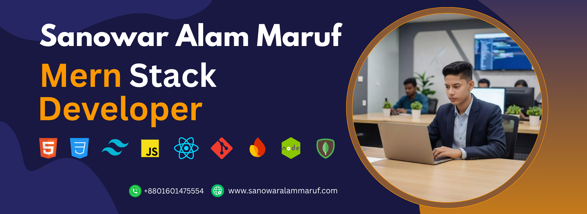

<!-- Banner Image -->

  

  

---

<!-- 🧑‍💻 About Me -->
<h1 align="center" style="font-size: 2rem; color: #5CE1E6; margin-top: 3rem;">🧑‍💻 About Me</h1>
<h4>
  I'm a passionate full-stack web developer skilled in building responsive, high-performance web applications using HTML, CSS, Tailwind, and JavaScript. I love creating dynamic user experiences with React and Firebase, and building robust backends using Node.js, Express.js, and MongoDB. I enjoy transforming ideas into clean, functional code and delivering end-to-end solutions with modern technologies.
</h4>

<h3>
  💡 What I've learned so far:
</h3>

<ul>
  <li>HTML, CSS, Tailwind CSS</li>
  <li>JavaScript & React</li>
  <li>Firebase (Authentication & Firestore)</li>
  <li>Node.js, Express.js</li>
  <li>MongoDB</li>
</ul>

<h3>
  🚀 Next up in my development journey:
</h3>

<ul>
  <li>TypeScript</li>
  <li>Redux for state management</li>
  <li>Next.js for powerful server-side rendering</li>
  <li>SQL, PostgreSQL & Prisma for advanced database handling</li>
  <li>Docker for containerization</li>
  <li>AWS for cloud services and deployment</li>
</ul>

<h3 align="center" style="font-size:1.2rem;">
  🚀 I love exploring challenging technologies and 
  leveling up my skills 
  with the latest tools and frameworks to build 
  next-gen web apps 💻🌐✨
</h3>

<h4>
  🔍 I welcome feedback, collaboration, and contributions to my projects — feel free to check out my repos!  
  🤝 I thrive in collaborative environments, value open communication, and enjoy contributing to the global tech community through learning and sharing.
</h4>

---

<!-- 🛠️ Tech Stack -->
<h1 align="center" style="font-size: 2rem; color: #5CE1E6; margin-top: 3rem;">🛠️ Tech Stack</h1>

<h2>⚡ My Code Runs on These Engines</h2>

| **Skills Overview**       | **Technologies**                                                                                                                                                          |
|---------------------------|---------------------------------------------------------------------------------------------------------------------------------------------------------------------------|
| **Languages**             |  |
| **Frontend Technologies** |      |
| **Back-End Development**  |   |
| **Database**              |  |
| **Tools & Platforms**     |       |

---

<!-- 📬 Connect With Me -->
<h1 align="center" style="font-size: 2rem; color: #5CE1E6; margin-top: 3rem;">🌐 Connect With Me</h1>

Feel free to reach out or connect with me through any platform below. Let’s discuss exciting opportunities!

<section id="contact" style="color: #fff; padding: 2rem; background-color: #0e0e0e; border-radius: 10px; max-width: 700px; margin: auto;">
  <ul style="list-style: none; padding-left: 0; text-align: center; font-size: 1rem;">
    <li><strong>Email:</strong> <a href="sanowaralammaruf@gmail.com" style="color: #4EA1D3;">sanowaralammaruf@gmail.com</a></li>
    <li><strong>LinkedIn:</strong> <a href="" target="_blank" style="color: #4EA1D3;">linkedin.com/sanowar.alam</a></li>
    <li><strong>Facebook:</strong> <a href="https://www.facebook.com/sam.freelancing.ox" target="_blank" style="color: #4EA1D3;">facebook.com/sam.freelancing</a></li>
    <li><strong>Facebook:</strong> <a href="https://www.instagram.com/samfreelancingox/" target="_blank" style="color: #4EA1D3;">instagram.com/sam.freelancing</a></li>
    <li><strong>Portfolio:</strong> <a href="https://www.eftajulshadi.dev" target="_blank" style="color: #4EA1D3;">https://samdev</a></li>
  </ul>
</section>

---

<!-- 📊 GitHub Stats -->
<h1 align="center" style="font-size: 2rem; color: #5CE1E6; margin-top: 3rem;">📊 GitHub Stats</h1>

  

    
    
  

  

<!-- 🐍 Contribution Snake -->

---

<!-- 🎯 Fun Fact -->
<h1 align="center" style="font-size: 2rem; color: #5CE1E6; margin-top: 3rem;">🎯 Fun Fact</h1>

  ☕ I can turn your Figma dreams into fully functional responsive UIs while sipping tea and blasting lo-fi at 2 AM 🌙🎧

---

  "The only way to do great work is to love what you do." – Steve Jobs

